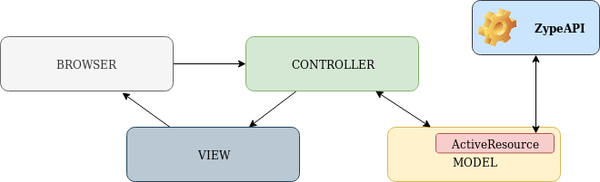

# README

ZypeApi coding challenge.

## Pre-requisites

* Ruby 2.5.5

* Rails 6.0.1

* Yarn

* Database creation

* Database initialization

## Installation

* Fork & clone the repository into your local development setup.

* Make sure bundler are yarn are installed.

* Run bundle install.

* ZypeApi Challenge assumes you have the api key defined in credentials as **api_key** at root level. It also allows it to be set in an **ENV** variable at **API_KEY**.

* Enjoy!

# Architecture

## Overview

The solution consists of a two site/views web application.
The first one, is the video fee, where user will get a paginated video fee of all available videos from the Zype API. This view also serves as home or default view.
The second view, allows the user to play the selected video.

## Design

The solution follows the standard RoR **MVC** pattern, consisting of a video model and controller.

**ActiveResource** gem was added to provide communication with the Zype API. This decision was based in the following benefits it provides:
* Elegant RESTful wrapper between ruby models and API responses.
* ActiveRecord like philosophy and methods.
* Seamless integration.
* Ease of use.
* It relies directly on ruby’s **Net::HTTP** instead of third party http libraries.

Even though ActiveResource is design to be completely transparent, it expects the response body to be in an specific format. Therefore, a few adjustments were necessary to be made to allow it to process the responses from the Zype API.

To encapsulate the communication logic in a single, replaceable component, a small facade was added called **ApiRecord**. Any model inheriting from it, will automatically know how to communicate with the Zype API.

```

```